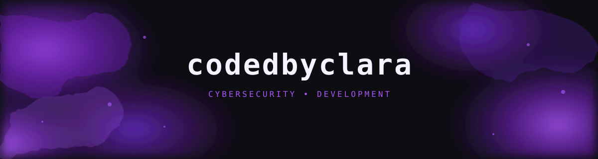

 <div align="center">



# 💜 `codedbyclara`

### Desenvolvendo ideias. Explorando a segurança. 🔐

`ADS Student` · `Developer in Progress` · `Cybersecurity Enthusiast`

</div>

---

# 💜 Oii! Eu sou a Clara

### Transformando curiosidade em código.

🎓 Estudante de **Análise e Desenvolvimento de Sistemas (ADS)**, do Brasil 🇧🇷

Sou apaixonada por tecnologia e estou construindo minha jornada na programação e na cibersegurança. Gosto de entender como as coisas funcionam, resolver problemas e aprender algo novo a cada projeto.

---

## 🖥️ Sobre mim

* 💻 Estudando desenvolvimento de software e lógica de programação.
* 🔐 Explorando o universo da cibersegurança.
* 🐧 Aprendendo sobre Linux, redes e segurança digital.
* 🌱 Evoluindo um projeto e um commit de cada vez.
* 🚀 Compartilhando minha evolução por meio de projetos e experiências práticas.

## 🛠️ Tecnologias que estou estudando


* **Linguagens:** C e Python
* **Banco de dados:** SQL e MySQL
* **Sistemas operacionais:** Linux e Windows
* **Ferramentas:** Git e GitHub
* **Interesses:** desenvolvimento seguro e cibersegurança ética

## 🚀 Projetos em destaque

### 🔐 Cybersecurity Learning

Meu espaço de estudos em cibersegurança, com anotações, conceitos, ferramentas e aprendizados práticos.

**[→ Explorar meu repositório](https://github.com/codedbyclara/cybersecurity-learning)**

## 🎯 Meus objetivos

* Construir projetos próprios e acadêmicos.
* Fortalecer minha lógica de programação.
* Aprender mais sobre segurança de sistemas e redes.
* Transformar conhecimento em prática.
* Construir um portfólio que documente minha evolução.

## 🌌 Minha filosofia

> A curiosidade abre portas. A prática transforma possibilidades em conhecimento.

`while (aprendendo) { continuar_evoluindo(); }`

---

## 💚 `terminal://clara`

```python
while learning:
    build_projects()
    improve_skills()
    stay_curious()
```

<p align="center">
  <sub>CODE. LEARN. SECURE.</sub>
  <br />
  <sub>✦ Feito com curiosidade, café e muitos commits. ☕💜</sub>
</p>
